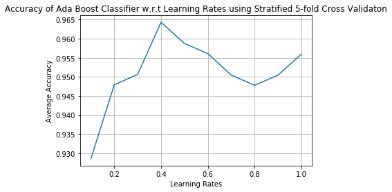

# Semi-automated Centrosome Pairing

This document describes the steps to track and pair centrosomes from time-lapse movies of *C. elegans* germline.

## Usage

#### Materials and Requirements
- a registered time-lapse tiff movie and its correponding translation matrix (i.e., the ROI csv files), see [this repository](https://github.com/gerhold-lab/Semi-automated-GSC-registration/) for registration.
- [FIJI](https://imagej.net/Fiji) (with [TrackMate](https://imagej.net/TrackMate) installed)
- numpy
- pandas
- scipy
- matplotlib
- skimage
- pickle

### 0 Register your movie
See [this repository](https://github.com/gerhold-lab/Semi-automated-GSC-registration/) for help.

### 1 Run your movie through [TrackMate](https://imagej.net/TrackMate)
** *Script to streamline the TrackMate commands to come*

### 2 Checklist
In your data folder, you need to have the following:

|File Name| Descriptions  	|
|---	    |---	            |
|ROI.csv  | Contains x-y coordinates that was used to register the original movie  |
|u_germline.tif| The original movie, "u" for "unregistered" |
|r_germline.xml   	| The xml output from TrackMate, using the registed movie, "r" for "registered"  |

### 3 Run the script: track_pairer.py
1. If your translation matrix consists of multiple files, you need to combine them first. For example,
```
mat1 = pd.read_csv("1.csv", header = None)
mat1 = roi2mat(mat1)
mat2 = pd.read_csv("2.csv", header = None)
mat2 = roi2mat(mat2)
trans_mat = combine_roi(mat1, mat2)
```
If your translation matrix is a single csv, simply proceed to the next step.

2. If your translation matrix was obtained from a compressed movie, you need to multiply it by the number of fold. For example, if you compressed the movie by 3 fold, do
```
trans_mat = trans_mat * 3
```
If your translation matrix was obtained from the original movie without compression, simply proceed to the next step.

3. Crude filtering and feature generation
```
myPairer = pairer(xml_path, trans_mat)
cells = myPairer.findNeighbors()
df = cell2df(cells)
df.to_csv ('features.csv', index = False, header=True)
X_df = pd.read_csv('features.csv', usecols = range(9))
X = X_df.to_numpy()
```
4. Load classifier and predict
```
X_df = pd.read_csv('features.csv', usecols = range(9))
X = X_df.to_numpy()
clf = pickle.load(open('../ML/myModel.sav', 'rb'))
# predict
y_pred = clf.predict(X)
df['Predicted_Label'] = y_pred
df.to_csv ('predictions.csv', index = False, header=True)
```

<<<<<<< HEAD
## How I built the model: a brief description of the classifier development pipeline
### 1 Data Preprocessing

##### 1. Parsing
The TrackMate output is parsed to generate the following information:
  - **edges**, consisting of
    - source spot ID
    - target spot ID
    - time
    - track ID that the edge belongs to
  - **tracks**, consisting of
    - track ID
    - t_i, the time point where the track starts
    - t_f, the time point where the track ends
    - time duration
  - **spots**, consisting of
    - x, y, z, t
    - spot ID

##### 2. Crude filtering and feature generation
- For each track:
  - if track duration < 10 frames (= 5 min), discard
- For every potential track pair, the following filters are applied:
  - if the time period of overlap between the pair is less than 10 frames, discard
  - if the mean distance* between the pair is greater than 8 microns (about 30 voxels), discard

Additionally, the following statistics are calculated:

- **sl_i**: the spindle length at the track start time, i.e., the Euclidean distance between the two centrosomes at starting point;
- **sl_f**: the spindle length at the track end time, i.e., the Euclidean distance between the two centrosomes at end point;
- **sl_max**: the maximum spindle length during the cell division;
- **sl_min**: the minimum spindle length during the cell division;
- **t_cong**: the number of continuous time points in which the spindle length is under 4 microns (15 voxels);
- **t_overlap**: track duration;
- **center_stdev**: the standard deviation of the cell center position, by taking the square root of the sum of the variances of x, y, z coordinates of the center point (i.e., the midpoint of the two centrosome locations) over the track duration;
- **normal_stdev**: the standard deviation of the normal vector of the metaphase plate, i.e., stdev of the direction vector obtained by (x1,y1,z1) - (x2,y2,z2) for all time points, where (x1,y1,z1) and (x2,y2,z2) are centrosome locations of the track pair at a given time point.
- **dist_center_to_border**: the Euclidean distance from the mean cell center point to the closest movie border (the border before registration). This feature is designed to discriminate the spurious tracks on the borders likely due to the movie registration.

*Note: **mean distance** is calculated by taking the average of the spindle length at each time point. It is not included as a classification feature.

##### 3. Building a classifier
1. Model selection
The following classifiers are selected for testing:
  - [AdaBoost](https://scikit-learn.org/stable/modules/generated/sklearn.ensemble.AdaBoostClassifier.html)
  - [Random Forest](https://scikit-learn.org/stable/modules/generated/sklearn.ensemble.RandomForestClassifier.html)
  - [Decision Tree](https://scikit-learn.org/stable/modules/generated/sklearn.tree.DecisionTreeClassifier.html)
  - [Linear Support Vector Machine](https://scikit-learn.org/stable/modules/generated/sklearn.svm.LinearSVC.html#sklearn.svm.LinearSVC)
  - [SVM with Stochastic Gradient Descent](https://scikit-learn.org/stable/modules/generated/sklearn.linear_model.SGDClassifier.html#sklearn.linear_model.SGDClassifier)
  - [Logistic Regression](https://scikit-learn.org/stable/modules/generated/sklearn.linear_model.LinearRegression.html)

2. Hyperparameter tuning
Results:
\
